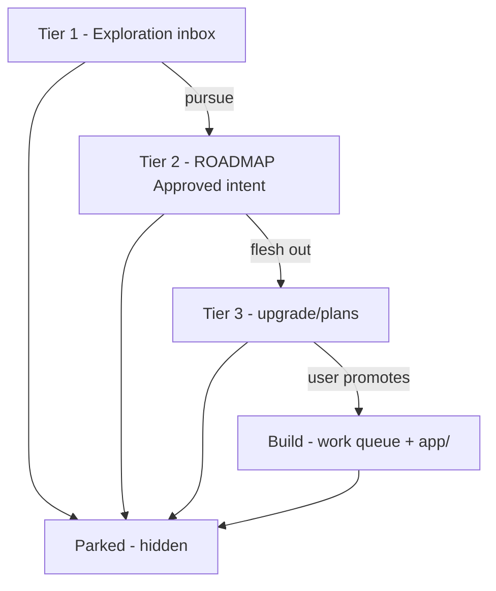

# Design tiers — explore → intent → design → build

**Purpose:** Workflow for the upgrade program. **Hub:** [`README.md`](README.md)

| | |
|---|---|
| **Last updated** | 2026-08-26 |
| **Folder** | `docs/upgrade/` |
| **Agent gate** | [`.cursor/rules/design-tier-gate.mdc`](../../.cursor/rules/design-tier-gate.mdc) |
| **Build order** | [`../ROADMAP.md`](../ROADMAP.md) work queue only |

---

## The four stages + parked



| Stage | Name | Location | On agent default lists? | Buildable? |
|-------|------|----------|-------------------------|------------|
| **Tier 1** | Exploration | [`inbox/`](inbox/README.md) | No | No |
| **Tier 2** | Approved intent | [`../ROADMAP.md`](../ROADMAP.md) § **Approved intent** | **Yes** | No |
| **Tier 3** | Design / PLAN | [`plans/`](plans/README.md) | Via Tier 2 link only | No |
| **Build** | Implementation | project source + **work queue** | **Yes** | Yes — phase approval |
| **Parked** | Not investing now | [`parked/PARKED.md`](parked/PARKED.md) | **No** | No |

**Tier 2 row persists** when Tier 3 is drafted — update the row: *Design drafted → link*.

**Parked** removes the item from Tier 1 active, Approved intent, and work queue. PLAN files may remain on disk.

---

## Promotion gates (human)

| From → To | Requirement |
|-----------|-------------|
| Tier 1 → 2 | Add **Approved intent** row in ROADMAP (outcome-based name); archive idea in inbox |
| Tier 2 → 3 | Flesh out `plans/*_PLAN.md`; **keep** Tier 2 row; add design link on row |
| Tier 3 → Build | Move to **work queue** + [`BUILD_HANDOFF.md`](BUILD_HANDOFF.md) + “implement Phase X” |
| Any → Parked | Add to [`parked/PARKED.md`](parked/PARKED.md); remove from all active lists |
| Parked → active | User revives → Exploration and/or Approved intent; log in Parked revive section |

---

## List naming

Use **outcome names** on ROADMAP and Parked — not internal phase IDs (`Phase 3d`), tab names alone, or codenames.

---

## Where files live

| Kind | Path |
|------|------|
| **Start here** | `docs/upgrade/README.md` |
| Tier 1 | `docs/upgrade/inbox/` |
| Tier 2 | `docs/ROADMAP.md` § Approved intent |
| Tier 3 PLANs | `docs/upgrade/plans/*_PLAN.md` |
| Parked | `docs/upgrade/parked/PARKED.md` |
| POC spikes | `docs/upgrade/plans/spikes/` |
| Build handoff | `docs/upgrade/BUILD_HANDOFF.md` |
| Shipped truth | `docs/PRODUCT_REFERENCE.md`, work queue |

---

## Agent handoff (Build)

```
Read docs/upgrade/BUILD_HANDOFF.md.
Read docs/upgrade/plans/<NAME>_PLAN.md.
Implement <Phase ID> only.
```

---

## Current state snapshot (2026-08-26)

**Build:** Work queue **empty**.

**Foundation shipped:** ROADMAP Phases 1–7 ☑ · 6.5.0 maintainability ☑.

### Approved intent (Tier 2) — three tracks

| Name | Tier 3 |
|------|--------|
| Rescue: bootable USB for offline target PC | [`plans/RESCUE_USB_PLAN.md`](plans/RESCUE_USB_PLAN.md) |
| Analysis: built-in minidump engine (no CDB install) | [`plans/NATIVE_DUMP_ENGINE_PLAN.md`](plans/NATIVE_DUMP_ENGINE_PLAN.md) |
| UX: guided diagnosis in plain language + hardware guidance | [`plans/GUIDED_DIAGNOSTIC_PLAN.md`](plans/GUIDED_DIAGNOSTIC_PLAN.md) |

### Exploration (Tier 1) — active

**Action Plan: step checklist and session progress** — flow/behavior TBD → [`inbox/EXPLORATION_LOG.md`](inbox/EXPLORATION_LOG.md).

### Parked

Four items — [`parked/PARKED.md`](parked/PARKED.md). Agents ignore unless user asks.

**Shipping code today:** CDB via `bsod_minidump.analyze_minidump_with_cdb`.

---

## Related

- [`PLANNING_AGENT.md`](PLANNING_AGENT.md) — planning chats
- [`../ROADMAP.md`](../ROADMAP.md) — Approved intent + work queue
- [`parked/PARKED.md`](parked/PARKED.md) — hidden ideas
