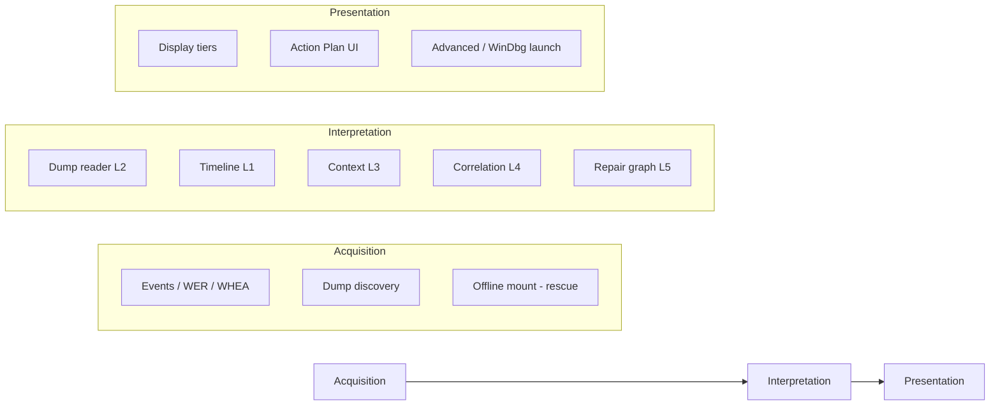

# Analysis core — unified architecture (Tier 3)

**Status:** Draft · **Tier 2:** informs all three Approved intent tracks · **Not buildable until work queue + phase approval**

| | |
|---|---|
| **Hub** | [`NEXT_UPGRADE_INDEX.md`](NEXT_UPGRADE_INDEX.md) |
| **Integration (Build)** | [`INTEGRATION_PATH.md`](INTEGRATION_PATH.md) |
| **Spike scaffold** | [`spikes/analysis_core/README.md`](spikes/analysis_core/README.md) |
| **Last updated** | 2026-09-03 |

This doc **does not replace** track PLANs (`NATIVE_DUMP_*`, `GUIDED_*`, `RESCUE_*`). It defines the **shared layers** so work does not fall between tracks.

---

## Where we are today (v6.5.x)

| Layer | Shipped? | Location |
|-------|----------|----------|
| **Acquisition** | ☑ Strong | `gather_report_data()` / `analyzer_gather.py` — events, dumps list, WHEA, thermals, inventory |
| **Interpretation** | ☑ Partial | `build_report_derivations()`, `crash_report_*`, confidence ladder, incident matching, driver verification |
| **Dump reader (L2)** | ☑ Via **CDB subprocess** | `bsod_minidump.analyze_minidump_with_cdb` → dict → `enrich_windbg_analysis` |
| **Presentation** | ☑ | GUI Summary / Action Plan / Advanced; export |
| **Native dump reader** | ☐ | Spike only — [`spikes/analysis_core/`](spikes/analysis_core/README.md) |
| **Rescue offline acquisition** | ☐ | Design in [`RESCUE_USB_PLAN.md`](RESCUE_USB_PLAN.md) 9a–9b |

**Blur to fix in Build:** dump **parsing** currently runs **inside** the gather bundle (`analyze_recent_minidumps` in `bsod_crash_report.py`, called from `analyzer_gather.py`) and **requires `cdb_path` today**. Target: acquisition finds dumps; **interpretation** owns readers.

---

## Dump file formats (Windows BSOD)

| Signature | Format | Typical source | Native spike (D1) |
|-----------|--------|----------------|-------------------|
| **`PAGE`** (`0x45474150`) | Kernel **triage** / DUMP_HEADER64 | `C:\Windows\Minidump\*.dmp` on Win10/11 | ☑ Reads `BugCheckCode` + P1–P4 from header |
| **`MDMP`** | Classic user-mode minidump | App crashes, some tools | ◐ ExceptionStream scan only — not primary BSOD path |
| **`PAGEDU64` / full dump** | Kernel full memory | `MEMORY.DMP` | Out of scope for minidump track v1 |

**Build implication:** D2 native engine must treat **PAGE triage** as the primary parity target; evaluate [kdmp-parser](https://github.com/0vercl0k/kdmp-parser) for driver list / stack. CDB remains reference via `!analyze`.

Spike detail: [`spikes/analysis_core/CORPUS_POLICY.md`](spikes/analysis_core/CORPUS_POLICY.md) · fixture: [`spikes/analysis_core/fixtures/page_minimal.dmp`](spikes/analysis_core/fixtures/page_minimal.dmp).

---

## Three layers (canonical vocabulary)

| Layer | Question | Owns | Does **not** own |
|-------|----------|------|------------------|
| **Acquisition** | What evidence exists? Where on disk? | Paths, reads, parallel gather, **data gaps** | Cause headline, plain English |
| **Interpretation** | What happened? What faulted? Hardware vs software? What next? | Dump dict, correlation, confidence, cause **taxonomy**, repair steps | Qt widgets, tab layout |
| **Presentation** | How does the user see/act on it? | Wording, tiers, checklists, export layout | Re-parsing dumps differently per tab |

**Track mapping:**

| Track PLAN | Primary layer |
|------------|---------------|
| [`NATIVE_DUMP_ENGINE_PLAN.md`](NATIVE_DUMP_ENGINE_PLAN.md) | Interpretation — **L2 dump reader adapter** |
| [`GUIDED_DIAGNOSTIC_PLAN.md`](GUIDED_DIAGNOSTIC_PLAN.md) | Interpretation (G3–G5) + Presentation (G1, tiers) |
| [`RESCUE_USB_PLAN.md`](RESCUE_USB_PLAN.md) | Acquisition (9a–9b) + rescue runtime |
| [`RESCUE_BOOT_ENVIRONMENT.md`](RESCUE_BOOT_ENVIRONMENT.md) | Runtime shell — **decision gate**, not analysis logic |

---

## Dump analysis contract (L2)

Production today consumes this dict shape (from CDB parse + `enrich_windbg_analysis`):

| Field | Required for pipeline | Notes |
|-------|----------------------|--------|
| `faulting_driver` | Preferred | `.sys` / module name |
| `bugcheck_code` | Preferred | e.g. `0x00000050` |
| `bugcheck_str` | Preferred | Human stop name |
| `bugcheck_p1` | Optional | First parameter |
| `failure_bucket_id` | Optional | Microsoft bucket |
| `stack_frames` | Optional | ≤12 module+offset strings |
| `process_name`, `symbol_name` | Optional | |
| `kernel_stack_top`, `actionable_stack_frame` | Optional | Added by enrich |
| `raw` | Optional | Truncated lines for Advanced |
| **`analysis_source`** | **New at Build** | `native` \| `cdb` \| `none` (spike uses `native_stub` until D2b) |
| **`analysis_confidence`** | **New at Build** | `high` \| `medium` \| `low` — drives D4 fallback |

**Build rule:** Native reader **must** emit the same keys CDB path emits today (D2b). Downstream renames `enrich_windbg_analysis` → neutral name (e.g. `enrich_dump_analysis`) without changing semantics.

Spike contract: [`spikes/analysis_core/contract.py`](spikes/analysis_core/contract.py).

---

## WinDbg / CDB — levels per runtime (not one global decision)

| Level | Meaning | Maintenance (Windows exe) | Linux rescue | WinPE rescue |
|-------|---------|----------------------------|--------------|--------------|
| **A** | Default Run Analysis without CDB | **Target** (native primary) | **Required** | Optional native |
| **B** | No install prompts for basic analysis | **Target** | N/A (no CDB) | Optional |
| **C** | Unbundle CDB from PyInstaller | Optional (D5) | N/A | N/A |
| **D** | Internal CDB fallback when native low confidence | **Recommended** (D4) | **No** | Optional |
| **E** | **Open in WinDbg** / technician depth | **Keep forever** | Only via **hybrid WinPE** or “boot Windows + maintenance exe” | Easier |
| **F** | Zero WinDbg anywhere | **Reject** | Forced on Linux path | Unlikely |

**Linux + rescue:** CDB/WinDbg **do not run on Linux**. Native dump (or another portable parser) is **mandatory** for on-stick dump attribution. WinDbg remains **Level E** on **Windows maintenance** and optionally on a **WinPE repair** partition ([`RESCUE_BOOT_ENVIRONMENT.md`](RESCUE_BOOT_ENVIRONMENT.md) Option C).

**Parity:** CDB stays a **reference engine** in dev (D1 harness) even if not shipped in OSS rescue images.

---

## Cause taxonomy (single owner — Interpretation)

Avoid duplicate heuristics in native parser **and** Summary copy **and** confidence ladder.

| Family | Owner | Example inputs |
|--------|-------|----------------|
| `driver` | Interpretation core | faulting `.sys`, bucket, stack |
| `memory` | Interpretation core | bugcheck class, WHEA memory |
| `disk` | Interpretation core | storage bugchecks, disk WHEA |
| `power_thermal` | Interpretation core | thermals, `_THERMAL` stops |
| `hardware_whea` | Interpretation core | WHEA component |
| `unknown` | Interpretation core | insufficient evidence |

Presentation (G1) **maps families to strings** — does not invent new families. Reuse existing `get_bugcheck_info()` / confidence ladder in `bsod_crash_report.py` — do not fork bugcheck naming at Build.

---

## Build order (recommended promote sequence)

Work queue stays empty until user promotes. **Suggested** phase order across tracks:

| Step | Phase | PLAN | Layer | Blocks |
|------|-------|------|-------|--------|
| 1 | **D1** | Native | Interpretation | Parity harness + corpus |
| 2 | **D2 + D2b** | Native | Interpretation | Production adapter contract |
| 3 | **G1** | Guided | Presentation (on existing CDB dict OK) | None — use taxonomy from core doc |
| 4 | **D3–D4** | Native | Interpretation | Stack + fallback policy |
| 5 | **G2–G5** | Guided | Interpretation + Presentation | G2 after D2b |
| 6 | **9a–9b** | Rescue | Acquisition | Boot-agnostic |
| 7 | **Rescue shell 9d–9e** | Rescue | Runtime | After [`RESCUE_BOOT_ENVIRONMENT.md`](RESCUE_BOOT_ENVIRONMENT.md) decision gate |

**Decision gate (boot OS):** After **D1 + 9b + Linux smoke spike** — score Linux vs WinPE vs hybrid. See rescue boot doc.

---

## Gap risks (explicit seams)

| Seam | Failure mode | Mitigation |
|------|--------------|------------|
| Gather → Interpret | Events never normalized to **incident model** | Keep `build_report_derivations` as single fusion point |
| Native vs Guided heuristics | Two vocabularies for same bugcheck | **Cause taxonomy** table above — one owner |
| Interpret → Present | Summary re-implements rules | Presentation reads **derived model** only |
| Linux rescue | CDB assumed available | Native L2 required; document in boot matrix |
| G1 before D2b | Plain English trained on CDB quirks | G1 keys off **stable fields**; G2 after adapter |

---

## Open decisions (log here when user decides)

| # | Question | Status |
|---|----------|--------|
| 1 | First promote: D1 only vs D1+D2 bundle? | **Planning default: D1 only** — confirm before promote ([`PROMOTE_WHEN_READY.md`](PROMOTE_WHEN_READY.md)) |
| 2 | CDB fallback threshold (D4) — always internal vs user-visible? | **Planning default: internal fallback at D4**; keep bundled CDB until D4 tested |
| 3 | Rescue v1: diagnose-only vs must offline-install drivers? | Open — boot doc |
| 4 | Symbol server / PDB in product vs Advanced-only? | Open — Native D7? |
| 5 | Single OSS repo vs core + WinPE servicing add-on? | Open |

---

## Handoff for planning agents

- Update **this doc** when layer boundaries or contract fields change.
- Update **track PLANs** for phase checklists only.
- Spike work stays in [`spikes/analysis_core/`](spikes/analysis_core/README.md) — never import into `bsod_minidump.py` until Build phase approved.

## Handoff for build agents

Read [`INTEGRATION_PATH.md`](INTEGRATION_PATH.md) + assigned track PLAN + `BUILD_HANDOFF.md` + active `HANDOFF_WQ*.md`.
