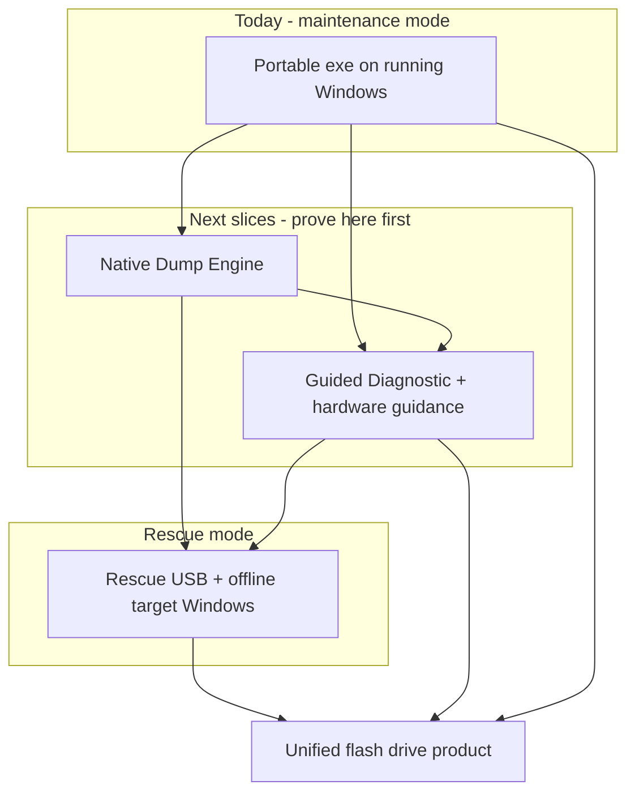

# Next major upgrade — index (Tier 3)

**Status:** Draft · **Not on work queue** · **No app implementation authorized**

| | |
|---|---|
| **Tier 2** | [`ROADMAP.md`](../../ROADMAP.md) § **Approved intent** — three tracks |
| **Tier 1** | [`inbox/EXPLORATION_LOG.md`](../inbox/EXPLORATION_LOG.md) |
| **Parked** | [`parked/PARKED.md`](../parked/PARKED.md) — hidden |
| **Process** | [`../DESIGN_TIERS.md`](../DESIGN_TIERS.md) |
| **Hub** | [`../README.md`](../README.md) |

Last updated: **2026-08-26**

---

## End product (north star)

One **bootable flash drive** that a technician or motivated owner can use across three situations:

| Mode | When | Outcome |
|------|------|---------|
| **Rescue** | PC BSODs, won’t boot, or unstable | Find **internal** Windows install → diagnose → **repair** (drivers, config, integrity steps) **or** conclude **hardware fault** with **which part(s)** to replace |
| **Maintenance** | System runs; no active crash crisis | Keep system **updated** — drivers, firmware awareness, catalog, Action Plan hygiene (today’s portable workflow, refined) |
| **Analysis-only** | Between the two | Deep evidence gathering even when full repair isn’t needed yet |

**UX principle:** Maximum capability **under the hood**; **plain language** on the surface (novice → technician tiers). Depth of analysis (including dump/debug technology) is an **implementation strategy**, not something the user must learn.

**Phased philosophy (user 2026-08-24):** Prove each piece in the **current app** on a live or mountable Windows install before adding rescue boot complexity. Phases 1–7 + maintainability **6.5.0** are the foundation — **in good shape; ready for the next slice.**

---

## Where today’s v6.5.x already delivers

| End-product need | Today (maintenance / analysis on running Windows) |
|------------------|---------------------------------------------------|
| BSOD attribution ladder | ☑ Verified / Focus / Unknown, minidump + events |
| Repair narrative + Action Plan | ☑ |
| Official driver discovery + install | ☑ Catalog tiers, pnputil, backup |
| Portable USB workflow | ☑ Default; per-machine cache |
| Hardware **signals** (not yet “replace RAM stick 2”) | ◐ WHEA, thermals, Live Kernel bundle |
| Boot from USB when internal Windows dead | ☐ Rescue track |
| Native dump engine (no debugger install story) | ☐ Native dump track |
| Hardware → **parts replacement** guidance | ☐ Guided diagnostic — expand G5+ |

---

## Upgrade tracks (build separately, integrate at end)

| Track | PLAN | Role in end product |
|-------|------|---------------------|
| **Built-in crash analysis (WinDbg/CDB replacement)** | [`NATIVE_DUMP_ENGINE_PLAN.md`](NATIVE_DUMP_ENGINE_PLAN.md) | Native `.dmp` parse → same report pipeline; no debugger install |
| **Guided diagnostic** | [`GUIDED_DIAGNOSTIC_PLAN.md`](GUIDED_DIAGNOSTIC_PLAN.md) | Deep multi-source analysis + plain UX; **hardware vs software**; parts guidance |
| **Rescue USB** | [`RESCUE_USB_PLAN.md`](RESCUE_USB_PLAN.md) | Boot media; target internal disk; repair when Windows can’t run the app |
| **Boot environment (open)** | [`RESCUE_BOOT_ENVIRONMENT.md`](RESCUE_BOOT_ENVIRONMENT.md) | Linux vs WinPE vs hybrid — **decide after analysis core slices** |

**Suggested promote order:** Native dump → Guided diagnostic (in-app) → Rescue USB.  
Adjust if field pain is “won’t boot” first — then parallelize Rescue 9a–9c with Native D1–D2.

---

## Dump / debug depth (open strategy — not rejected)

We have **not** ruled out growing toward **very deep** crash analysis. Options stay on the table:

| Approach | When it fits |
|----------|--------------|
| Native parser + our heuristics | Default path; cross-platform; rescue-friendly |
| Bundled / improved CDB engine | Fallback or parity benchmark |
| Deeper analysis over time | After D1 parity harness shows gaps |

**Decision deferred** until parity harness (Native D1) and real dump corpus exist. Goal is **best robustness**, not ideology.

---

## Display tiers (product UX — all tracks)

| Tier | Audience | Surface |
|------|----------|---------|
| **D1 — Novice** | “Just fix my PC” | Plain English; ≤3 steps; hardware vs software headline |
| **D2 — Comfortable** | Hobbyist / IT-curious | + versions, timeline, confidence |
| **D3 — Technician** | Shop / export | + stacks, raw evidence, parts list detail |

Canonical detail: [`GUIDED_DIAGNOSTIC_PLAN.md`](GUIDED_DIAGNOSTIC_PLAN.md).

---

## Open questions (umbrella)

| # | Question | Blocks |
|---|----------|--------|
| 1 | First promote: native dump vs guided G1 vs rescue 9a? | Work queue |
| 2 | Hardware parts guidance: how specific v1 (component class vs slot)? | Guided G5 |
| 3 | Primary field failure: won’t boot vs Safe Mode? | Rescue order |
| 4 | Dump depth: native-only vs keep CDB fallback? | Native D4 |
| 5 | Secure Boot on rescue USB? | Rescue 9e |
| 6 | Rescue boot OS: Linux vs WinPE vs hybrid? | Rescue 9d–9e — see [`RESCUE_BOOT_ENVIRONMENT.md`](RESCUE_BOOT_ENVIRONMENT.md) |

---

## Decisions log

| Date | Decision |
|------|----------|
| 2026-08-24 | 3-tier design workflow: explore → ROADMAP backlog → `design/` → work queue |
| 2026-08-24 | End product = rescue + maintenance on one flash drive |
| 2026-08-24 | Prove features in current portable app before rescue boot |
| 2026-08-24 | WinDbg-class **depth** is a goal; **interactive debugger UX** is not the default surface |
| 2026-08-24 | Deep dump strategy **open** — parity harness before locking approach |
| 2026-08-24 | Boot environment **open** — Linux lean (NIC, OSS, native dump); maintenance stays Windows portable |
| 2026-08-24 | Build **analysis core** cross-platform before locking rescue shell |
