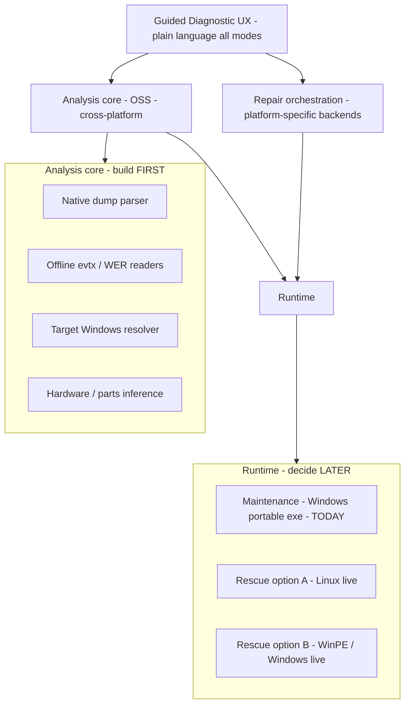

# Rescue boot environment — open architecture (Tier 3)

**Status:** Draft · **Decision not locked** · Informs [`RESCUE_USB_PLAN.md`](RESCUE_USB_PLAN.md) and [`NATIVE_DUMP_ENGINE_PLAN.md`](NATIVE_DUMP_ENGINE_PLAN.md)

| | |
|---|---|
| **Index** | [`NEXT_UPGRADE_INDEX.md`](NEXT_UPGRADE_INDEX.md) |
| **Last updated** | 2026-08-24 |

---

## Decision state

**Boot environment: OPEN.** Leaning factors recorded below; final choice after native dump parity (D1) and offline analysis slices (9a–9b) prove what rescue must do.

**Product will be open source** — architecture should prefer **inspectable, redistributable** components (native analysis core) over opaque or license-encumbered bundles where possible.

---

## User considerations (2026-08-24)

| Factor | Linux live | Windows live (WinPE / similar) |
|--------|------------|--------------------------------|
| **Generic NIC / WiFi** | Strong — main lean toward Linux | Weak unless per-machine driver injection |
| **Novice perception** | “Scary” OS shell | Familiar Windows chrome |
| **Novice reality** | Booting **any** USB rescue is already advanced | Same — booting USB is not Mac-buyer territory |
| **Open source story** | Clean stack; community can audit | WinPE/ADK licensing and redistribution limits |
| **Native dump engine** | One analysis codebase; no CDB-on-Linux problem | CDB works; bundled engine heavy |
| **Install drivers into target Windows** | Hard natively — needs DISM/WinPE path or staging | Natural (`DISM /Add-Driver`, `pnputil` offline) |
| **Maintenance mode** | N/A on rescue stick — maintenance stays **Windows portable exe** when OS runs | Same |

**Insight:** Rescue audience is **already** willing to boot USB. Optimize **in-app** UX (Guided Diagnostic D1) for novices; don’t choose boot OS primarily for “feels like Windows” unless data shows users abandon Linux rescue at high rates.

---

## Whole-pie architecture (build slices without locking boot OS)

Separate layers so slices compose regardless of final boot choice:

| Layer | Build when | Depends on boot OS? |
|-------|------------|---------------------|
| **Analysis core** | Native D1–D3, Rescue 9a–9b, Guided G1–G5 | **No** — must be cross-platform |
| **Maintenance runtime** | Today (v6.5) | Windows only — keep |
| **Repair: driver staging** | Rescue 9f+ | **Yes** — Windows servicing semantics |
| **Rescue runtime shell** | Rescue 9d–9e | **Yes** — this doc decides |

**Rule for slices:** Any code on the **critical path to Linux rescue** lives in **analysis core** (Rust or portable Python + native ext), not in Qt-on-Windows-only modules.

---

## Boot environment options (full matrix)

### Option A — Linux live primary (current lean)

- **Rescue:** Ubuntu/custom live + our GUI (Qt runs on Linux)
- **Network:** Generic NIC; download drivers to USB cache
- **Repair:** Stage packages + offline apply via **Windows servicing tools** (see hybrids below)
- **Maintenance:** User boots **internal Windows** → same portable exe as today (no Linux required)

### Option B — WinPE / Windows live primary

- **Rescue:** Custom WinPE, auto-launch app
- **Repair:** DISM/pnputil native
- **Cost:** NIC packs, ADK, redistribution, image size

### Option C — Hybrid USB (strong OSS + repair completeness)

| Partition / boot entry | Role |
|------------------------|------|
| **Linux live** (default boot) | Diagnose, network, download, plain-language UX, hardware guidance |
| **WinPE mini** (optional second boot) | “Apply repairs to Windows” — DISM driver staging only |
| **Data partition** | Portable Windows exe + caches (usable when Windows runs) |

User flow: Linux for 90%; menu item **“Install staged fixes (Windows PE)”** reboots into WinPE for servicing-only.

### Option D — Linux-only v1; defer offline install

- Rescue **diagnoses + stages** drivers and scripts on target volume
- Message: **“Reboot normally; run BSOD Analyzer from Windows to apply”** or one-click WinPE if present
- Smallest v1; incomplete for “won’t boot at all” until Option C

---

## Native dump engine ↔ boot choice

Building **our own** dump analysis (not shipping CDB as a dependency):

| Benefit | Whole-pie effect |
|---------|------------------|
| Same parser on Windows maintenance + Linux rescue | One attribution story |
| Open source reviewers see logic | No black-box `!analyze` |
| No “install Debugging Tools” | One less novice failure mode |
| Optional CDB parity benchmark | Measure gaps; add depth deliberately |

CDB may remain a **dev-only parity tool**, not shipped in OSS release — TBD at D1.

---

## Open source implications

| Component | OSS-friendly | Notes |
|-----------|--------------|-------|
| Native dump parser (Rust) | Yes | Prefer MIT/Apache; document format sources |
| evtx / offline readers | Yes | Python + existing OSS libs |
| Qt app on Linux | Yes | PySide6 cross-platform |
| Catalog fetch logic | Yes | HTTP/scrape tiers already ours |
| Microsoft CDB / WinPE | Restricted | Redistribution and build pipeline complexity |
| DISM offline apply | Tooling from Windows ADK | May ship **procedure** + optional WinPE blob separate from GPL core — legal review before release |

**Release shape (conceptual):** OSS **core** repo + optional **windows-servicing** assets or documented build-your-own-WinPE step.

---

## What to build before choosing boot OS

These slices **inform** the decision and **do not waste work** if OS choice flips:

| Slice | PLAN phase | Why |
|-------|------------|-----|
| Native dump parity harness | D1 | Proves depth without CDB |
| Target volume + offline logs | 9a–9b | Same paths Linux mounts `/mnt/target` |
| Guided plain-language layer | G1 | Same UX on any runtime |
| Spike: Qt app smoke on Linux live | `upgrade/plans/spikes/` | De-risks Option A |
| Spike: offline DISM from WinPE vs staged-only | `upgrade/plans/spikes/` | De-risks repair on Option A |

**Decision gate:** After D1 + 9b + one Linux smoke spike → score options A–D against: NIC success, repair completeness, OSS cleanliness, image size, build CI.

---

## Novice vs rescue (UX framing)

| User | What they do | What we optimize |
|------|--------------|------------------|
| **Mac buyer** | Runs tool **inside Windows** (maintenance) | D1 UX — never see Linux |
| **Motivated owner** | Boots USB once; follows 3 on-screen steps | Guided rescue wizard — not OS shell |
| **Technician** | Boots USB, picks target disk | Full controls + export |

Linux desktop exposure can be **minimal**: full-screen app at boot, no terminal, no package manager visible.

---

## Decisions log

| Date | Entry |
|------|--------|
| 2026-08-24 | Boot environment **not decided**; Linux lean for NIC + OSS + native dump |
| 2026-08-24 | Maintenance mode remains **Windows portable** — Linux rescue does not replace it |
| 2026-08-24 | Whole-pie: build **analysis core** cross-platform before locking rescue shell |
| 2026-08-24 | WinPE may remain **repair subprocess** even if Linux is primary rescue |

---

## Open questions

1. v1 rescue: diagnose-only (D) vs must offline-install drivers (requires C or B)?
2. Single OSS repo vs core + servicing add-on?
3. GUI toolkit on Linux rescue: same PySide6 app vs slim rescue UI?
4. Secure Boot + signed ISO for Linux default boot?

---

## Handoff

Do **not** implement rescue boot media until this doc’s **decision gate** is passed and user records choice in Decisions log.

Until then: implement **analysis core** slices only (D1, 9a–9b, G1).
